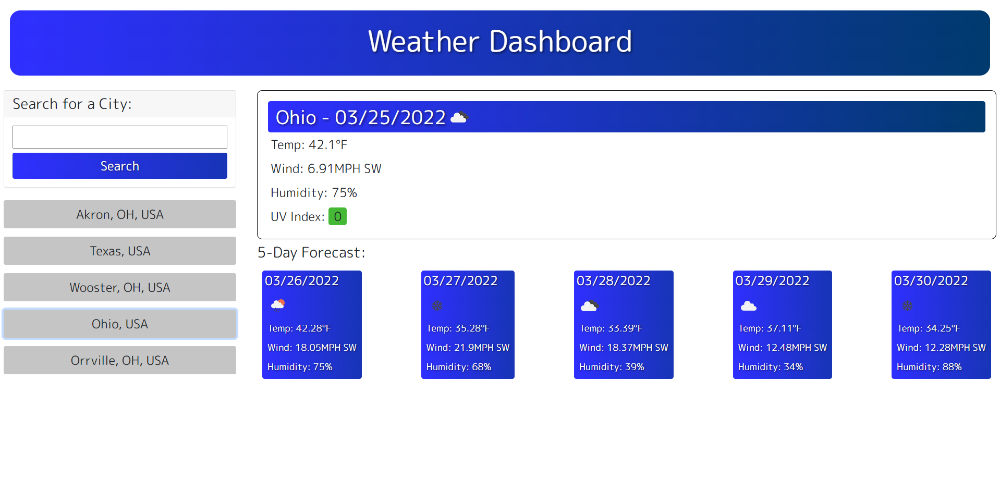

# Weather Application

## Description

Weather app pulls current and future weather data from the OpenWeather API.
Then, displays that data in an easy to digest format. It keeps a local record of
recent searches and allows the user to click on these options to redo a search.
Recents have been optimized to save coordinate values for a given location, so the
geocode API is only called on a new search. UV index updates in color to reflex the
severity of the value. Wind directions is also calculated an displayed along with speed.

## Link to Deployed

https://verbaldye.github.io/weather-app/

## Screenshot

